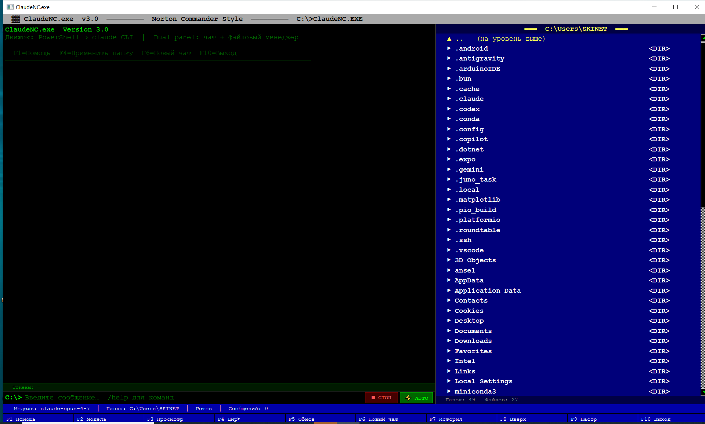

# ClaudeNC.exe

> Norton Commander–style GUI for [Claude Code](https://claude.ai/code) — no console, full DOS aesthetic.




---

## 🇷🇺 Русский

### Что это такое

ClaudeNC.exe — нативное PyQt6-приложение в стиле Norton Commander для работы с **Claude Code** через графический интерфейс вместо консоли. Левая панель — чат с Claude, правая — файловый менеджер. Полная поддержка AUTO и MANUAL режимов разрешений, статистика токенов, выбор модели, история директорий.

### Требования

| Компонент | Версия |
|-----------|--------|
| Python    | 3.10+  |
| PyQt6     | 6.4+   |
| Claude Code CLI | актуальная |

### Установка Claude Code CLI

1. Установите CLI с официального сайта: https://claude.ai/code

2. Авторизуйтесь в консоли — никакие API-ключи не нужны, достаточно обычного аккаунта Claude:
```bash
claude login
```
Откроется браузер для входа. После этого `claude` будет работать в любом терминале.

### Установка и запуск

**Windows:**
```bat
run.bat
```

**Linux / macOS:**
```bash
chmod +x run.sh
./run.sh
```

Лаунчер автоматически:
- Проверяет версию Python (нужна 3.10+)
- Устанавливает зависимости (`PyQt6`, `python-dotenv`)
- Проверяет наличие `claude` в PATH
- Запускает приложение без консольного окна

**Ручной запуск (если лаунчер не нужен):**
```bash
pip install -r requirements.txt
python msdos_claude.py
```

### Интерфейс

```
┌─────────────────────────────────────────────────────────────────────┐
│  ▓▓ ClaudeNC.exe  v3.0  ─────  Norton Commander Style  ────────    │
├──────────────────────────────────┬──────────────────────────────────┤
│                                  │  ═══  C:\Users\...  ═══          │
│   Чат с Claude                   │  ▲ ..  (на уровень выше)         │
│                                  │  ▶ Documents          <DIR>      │
│                                  │  ▶ Downloads          <DIR>      │
│   ВЫ> создай файл test.py        │    readme.txt          2K        │
│                                  │    config.json         1K        │
│   ✓ Файл создан                  │                                  │
│                                  │  Папок: 2   Файлов: 2            │
├──────────────────────────────────┴──────────────────────────────────┤
│  IN: 1,234  OUT: 456  │  💰 $0.0023  ИТОГО: $0.0045  │  ⏱ 3.2s    │
│  ⚠ Claude не смог выполнить...  [ ↺ Расширить разрешения ]         │
│  C:\>  [_________________________________] [■ СТОП] [⚡ AUTO]        │
│  Модель: claude-opus-4-7  │  Папка: C:\project  │  Готов  │  Сообщ: 3│
├─────────────────────────────────────────────────────────────────────┤
│ F1 Помощь │F2 Модель│F3 Просмотр│F4 Дир▶│F5 Обнов│F6 Новый чат... │
└─────────────────────────────────────────────────────────────────────┘
```

### Клавиши

| Клавиша | Действие |
|---------|----------|
| `F1` | Справка |
| `F2` | Сменить модель (Opus → Sonnet → Haiku → …) |
| `F3` | Просмотр выбранного файла |
| `F4` | Применить текущую папку как рабочую директорию Claude |
| `F5` | Обновить список файлов |
| `F6` / `Ctrl+N` | Начать новый чат (сброс сессии) |
| `F7` | История последних 10 папок |
| `F8` | Перейти на уровень вверх |
| `F9` | Настройки (язык, модель, папка запуска) |
| `F10` | Выход |
| `Ctrl+L` | Очистить чат |
| `Enter` | Отправить сообщение |
| `Двойной клик` | Открыть папку в файловом менеджере |

### Команды в чате

| Команда | Описание |
|---------|----------|
| `/help` | Передать /help в Claude Code |
| `/agents` | Список агентов Claude Code |
| `/new` или `/reset` | Новый чат |
| `/cls` или `/clear` | Очистить экран |
| `/model opus` | Сменить модель (`opus`, `sonnet`, `haiku`) |
| `/exit` или `/quit` | Выйти из приложения |

### Режимы разрешений

**AUTO (⚡ AUTO — зелёный)** — Claude работает без запросов разрешений (`--dangerously-skip-permissions`). Подходит для доверенных проектов.

**MANUAL (⚡ AUTO — жёлтый)** — перед каждым запросом появляется диалог выбора инструментов. Можно разрешить только нужные операции (Read, Write, Bash и т.д.). Если Claude попытается использовать запрещённый инструмент, появится оранжевая полоса с кнопкой расширения разрешений.

### Настройки (F9)

- **Язык** — Русский / English
- **Модель по умолчанию** — выбор из доступных моделей Claude
- **Начальная директория** — папка, которая открывается при запуске

Настройки сохраняются в `.msdos_agent.json` рядом с приложением.

### Статистика токенов

После каждого ответа отображается:
```
IN: 1,234  OUT: 456  КЭШР: 100  КЭШЗ: 50  │  💰 $0.0023  ИТОГО: $0.0045  │  ⏱ 3.2s  ходов: 2
```
- **IN/OUT** — входящие/исходящие токены
- **КЭШР/КЭШЗ** — кэш прочитан/записан
- **💰** — стоимость текущего запроса / итого за сессию
- **⏱** — время ответа / количество ходов

### Файловый менеджер

- Автоматически обновляется каждые 2 секунды при изменении папки
- `▶` — директория, `▲ ..` — подняться выше
- `F3` — просмотр текстового файла
- `F4` — применить папку как рабочую директорию для Claude
- Двойной клик — войти в папку

### Конфигурация

Файл `.msdos_agent.json` создаётся автоматически:
```json
{
  "model": "claude-opus-4-7",
  "start_dir": "C:\\Users\\...",
  "recent_dirs": [],
  "win_w": 1280,
  "win_h": 720,
  "skip_perms": true,
  "lang": "ru"
}
```

### Устранение проблем

**`'claude' is not recognized`** — установите Claude Code CLI и выполните `claude login`.

**Приложение зависло в MANUAL режиме** — нажмите **■ СТОП**.

**Ошибка кодировки в run.bat** — используйте оригинальный `run.bat` из репозитория.

**PyQt6 не установлен** — лаунчер установит его автоматически. При ручном запуске: `pip install PyQt6`.

---

## 🇬🇧 English

### What is this

ClaudeNC.exe is a native PyQt6 application in Norton Commander style for working with **Claude Code** through a graphical interface instead of the console. Left panel — chat with Claude, right panel — file manager. Full support for AUTO and MANUAL permission modes, token statistics, model selection, directory history.

### Requirements

| Component | Version |
|-----------|---------|
| Python    | 3.10+   |
| PyQt6     | 6.4+    |
| Claude Code CLI | latest |

### Installing Claude Code CLI

1. Install from the official site: https://claude.ai/code

2. Log in from the terminal — no API keys needed, just a regular Claude account:
```bash
claude login
```
A browser window will open for sign-in. After that, `claude` will work in any terminal.

### Installation and launch

**Windows:**
```bat
run.bat
```

**Linux / macOS:**
```bash
chmod +x run.sh
./run.sh
```

The launcher automatically:
- Checks Python version (3.10+ required)
- Installs dependencies (`PyQt6`, `python-dotenv`)
- Checks for `claude` in PATH
- Launches the app without a console window

**Manual launch (if launcher is not needed):**
```bash
pip install -r requirements.txt
python msdos_claude.py
```

### Interface

```
┌─────────────────────────────────────────────────────────────────────┐
│  ▓▓ ClaudeNC.exe  v3.0  ─────  Norton Commander Style  ────────    │
├──────────────────────────────────┬──────────────────────────────────┤
│                                  │  ═══  C:\Users\...  ═══          │
│   Chat with Claude               │  ▲ ..  (go up)                   │
│                                  │  ▶ Documents          <DIR>      │
│                                  │  ▶ Downloads          <DIR>      │
│   YOU> create a file test.py     │    readme.txt          2K        │
│                                  │    config.json         1K        │
│   ✓ File created                 │                                  │
│                                  │  Dirs: 2   Files: 2              │
├──────────────────────────────────┴──────────────────────────────────┤
│  IN: 1,234  OUT: 456  │  💰 $0.0023  TOTAL: $0.0045  │  ⏱ 3.2s    │
│  ⚠ Claude couldn't complete...  [ ↺ Expand permissions ]           │
│  C:\>  [_________________________________] [■ STOP] [⚡ AUTO]        │
│  Model: claude-opus-4-7  │  Dir: C:\project  │  Ready  │  Msg: 3   │
├─────────────────────────────────────────────────────────────────────┤
│ F1 Help  │F2 Model│F3 View│F4 Dir▶│F5 Refresh│F6 New Chat...       │
└─────────────────────────────────────────────────────────────────────┘
```

### Keyboard Shortcuts

| Key | Action |
|-----|--------|
| `F1` | Help |
| `F2` | Switch model (Opus → Sonnet → Haiku → …) |
| `F3` | View selected file |
| `F4` | Apply current folder as Claude working directory |
| `F5` | Refresh file list |
| `F6` / `Ctrl+N` | Start new chat (reset session) |
| `F7` | History of last 10 directories |
| `F8` | Go one level up |
| `F9` | Settings (language, model, start folder) |
| `F10` | Exit |
| `Ctrl+L` | Clear chat |
| `Enter` | Send message |
| `Double click` | Open folder in file manager |

### Chat Commands

| Command | Description |
|---------|-------------|
| `/help` | Pass /help to Claude Code |
| `/agents` | List Claude Code agents |
| `/new` or `/reset` | New chat |
| `/cls` or `/clear` | Clear screen |
| `/model opus` | Switch model (`opus`, `sonnet`, `haiku`) |
| `/exit` or `/quit` | Exit application |

### Permission Modes

**AUTO (⚡ AUTO — green)** — Claude runs without permission prompts (`--dangerously-skip-permissions`). Suitable for trusted projects.

**MANUAL (⚡ AUTO — yellow)** — Before each request, a tool selection dialog appears. You can allow only specific operations (Read, Write, Bash, etc.). If Claude attempts to use a disallowed tool, an orange bar appears with an "Expand permissions" button.

### Settings (F9)

- **Language** — Russian / English
- **Default model** — choose from available Claude models
- **Start directory** — folder opened on launch

Settings are saved to `.msdos_agent.json` next to the application.

### Token Statistics

After each response:
```
IN: 1,234  OUT: 456  CR: 100  CW: 50  │  💰 $0.0023  TOTAL: $0.0045  │  ⏱ 3.2s  turns: 2
```
- **IN/OUT** — input/output tokens
- **CR/CW** — cache read/cache write tokens
- **💰** — cost of current request / total for session
- **⏱** — response time / number of turns

### File Manager

- Auto-refreshes every 2 seconds when directory changes
- `▶` — directory, `▲ ..` — go up
- `F3` — view text file
- `F4` — apply folder as Claude working directory
- Double-click — enter folder

### Configuration

`.msdos_agent.json` is created automatically:
```json
{
  "model": "claude-opus-4-7",
  "start_dir": "C:\\Users\\...",
  "recent_dirs": [],
  "win_w": 1280,
  "win_h": 720,
  "skip_perms": true,
  "lang": "en"
}
```

### Troubleshooting

**`'claude' is not recognized`** — install Claude Code CLI and run `claude login`.

**App hangs in MANUAL mode** — press **■ STOP**.

**Encoding error in run.bat** — use the original `run.bat` from the repository.

**PyQt6 not installed** — launcher installs it automatically. Manual: `pip install PyQt6`.

---

## Project structure

```
ClaudeNC.exe/
├── msdos_claude.py   # Main PyQt6 application
├── lang.py           # Russian / English localisation
├── launch.py         # Cross-platform launcher
├── run.bat           # Windows entry point
├── run.sh            # Linux / macOS entry point
├── requirements.txt  # Python dependencies
├── screenshot.png    # App screenshot
└── .msdos_agent.json # Auto-created config (git-ignored)
```

## License

MIT
